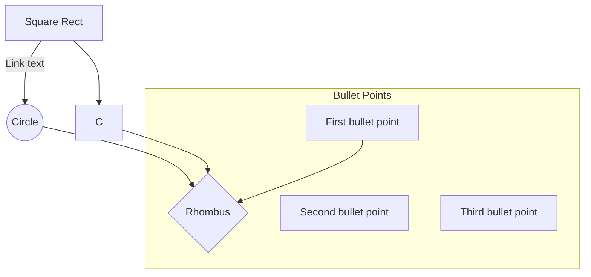
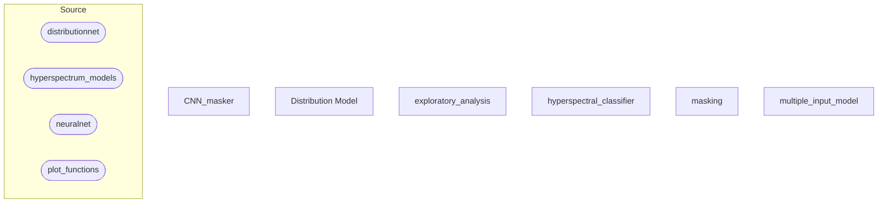

## Mermaid Flowchart Code Notes

General Arquitecture:

## Code Notes / Diagram
This is a description of how the Hyperspectral Masking algorithm is working through diagrams.

### General Arquitecture:
([Square Round])=.py
[Square Rect]=.ipynb

