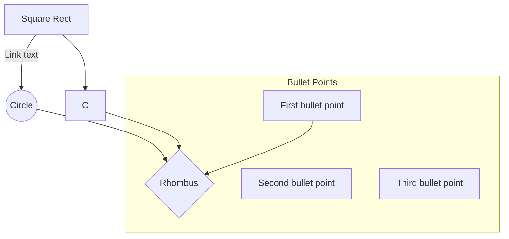

## Mermaid Flowchart Code Notes

General Arquitecture:

## Code Notes / Diagram
This is a description of how the Hyperspectral Masking algorithm is working through diagrams.

### General Arquitecture:
([Square Round])=.py   
[Square Rect]=.ipynb  
((Cicle))=libraries

### Libraries used
spectral: Hyperspectral image processing. Loading and manipulating hyperspectral data
keras: Interface for artificial neural networks. Interface for the TensorFlow library.
sklearn: Machine learning library that provides tools for data mining and data analysis.
joblib: Set of tools for working with Python functions. It provides tools for caching function results to disk, parallelizing function calls across multiple CPUs or computers, and more.
tensorflow:  Library is a machine learning library that provides tools for building and training machine learning models.

### Notebook Description:

CNN_masker:
* Libraries:
* Functions:
    * get_model(image_size):
* Description:

Distribution Model:
* Libraries: spectral, pandas, numpy, sklearn, joblib, keras, tensorflow
* Connections:
    * neuralnet->AutoEncoder
    * distributionnet->DistributionalEncoder
    * hyperspectrum_models->Masker
* Description: Fit distribution of crate (library for encoding and decoding images) data to match thin_section data.
* Process:
    * Set seed random with random-set_seed(tensorflow) to '1234'.
    * Open .hdr imsges with envi (spectral).
    * Calculate the center wavelengths of spectral envi (spectral).'
    * Get the .shape[-1] of the image
    * Loas the image with .load() (spectral).
    * Load joblib 'binaries/masker.joblib': Reconstruct a python object.
    * Apply the new constructed object to the load image.
    * Subscript the load image to the parameters gotten by the function.
    * Reshape (spectral)
    * Pickilng: Converting a Python object into a byte stream to store it in a file/database
    * Read pickle:'data/original_data/hyper[16_17_20].pkl' .values
    * StandardScaler? (sklearn.preprocessing)
    * AutoEncoder? (neuralnet)
    * Distributional Encoder? (distributionnet)
   

