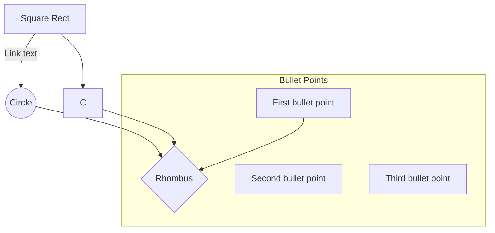

## Mermaid Flowchart Code Notes

General Arquitecture:

## Code Notes / Diagram
This is a description of how the Hyperspectral Masking algorithm is working through diagrams.

### General Arquitecture:
([Square Round])=.py   
[Square Rect]=.ipynb  
((Cicle))=libraries

### Libraries used
spectral: Hyperspectral image processing. Loading and manipulating hyperspectral data
keras: Interface for artificial neural networks. Interface for the TensorFlow library.
sklearn: Machine learning library that provides tools for data mining and data analysis.
joblib: Set of tools for working with Python functions. It provides tools for caching function results to disk, parallelizing function calls across multiple CPUs or computers, and more.
tensorflow:  Library is a machine learning library that provides tools for building and training machine learning models.
seaborn: data visualization based on matplotlib. high level interface drawing statistical graphs.
skimage: Image processing with numpy arrays.

### Notebook Description:

CNN_masker:
* Libraries:
* Functions:
    * get_model(image_size):
* Description:

Distribution Model:

* Libraries: spectral, pandas, numpy, sklearn, joblib, keras, tensorflow
* Connections:
    * neuralnet->AutoEncoder
    * distributionnet->DistributionalEncoder
    * hyperspectrum_models->Masker
* Description: Fit distribution of crate (library for encoding and decoding images) data to match thin_section data.
* Process:
    * Set seed random with random-set_seed(tensorflow) to '1234'.
    * Open .hdr images with envi (spectral).
    * Calculate the center wavelengths of spectral envi (spectral).
    * Get the .shape[-1] of the image
    * Load the image with .load() (spectral).
    * Load joblib 'binaries/masker.joblib': Reconstruct a python object.
    * Apply the new constructed object to the load image.
    * Subscript the load image to the parameters gotten by the function.
    * Reshape (spectral)
    * Pickilng: Converting a Python object into a byte stream to store it in a file/database
    * Read pickle:'data/original_data/hyper[16_17_20].pkl' .values
    * StandardScaler? (sklearn.preprocessing)
    * AutoEncoder? (neuralnet)
    * Distributional Encoder? (distributionnet)

Exploratory Analysis:

* Libraries: spectral, numpy, scipy, pandas, sklearn, matplotlib, seaborn, joblib
* Connections:
* Description: Plots and compares the average absorbance sample 620 with one cample from crate.
* Process:
    * Open .hdr image with envi (spectral).
    * Load the image with .load() (spectral).
    * Calculate the center wavelengths of spectral envi (spectral).
    * Print last two steps.
    * Convert a spectral wavelength to an RGB color value. (spectral.get_rgb())
    * Plot the rgb image with imshow (matplotlib)
    * Calculate and plot spectral wavelenght of hypr[150,120,:]. Plot wavelenghts, h.
    * Calculate and plot nth discrete difference of wavelenghts (np.diff())
    * Open 2nd image and calculate center wavelenghts.
    * Plot both wavelenghts in one plot.
    * Create interpolator with 1D Interpolations (scipy) of wavelenghts1, h.
    * print max and min wavelenghts of the two different images.
    * Load 2nd image and select [65:132, 122:205, :].reshape(-1,214).
    * Calculate Mean and stardard deviation of last step (axis 0) (numpy).
    * Plot the Mean , mean-3*std, mean+3*std, and the 1st image amplitudes in one axis.

Hyperspectral Classifier:

* Libraries: numpy, pandas, sklearn, matplotlib, seaborn
* Connections:
* Description: Create and test classifier to predict the minerals on hyperspectral image.
* Process:
    * Read pickle x:'data/original_data/hyper[16_17_20].pkl' and  Read pickle y:'data/original_data/mineral[16_17_20].pkl'
    * Plot the X sample 100.T for the wavelenght absorptions.
    * Set y to the index of first occurence of maximum over axis =1. and get unique values.
    * set the X and Y train and test with X and y values with train_test_split(model_slection - sklearn).
    * Create a classifier object with Pipeline (pipeline-sklearn). Set the steps to: PCA with n=8 components (decomposition-sklearn), StandardScaler (preprocessing-sklearn), and MLPClassifier(hidden_layer_sizes=(100,20,),max_iter=1000) (neural_network-sklearn).
    * Create a function scorer(estimator, x, y) to calculate the predictor f1 score.
    * Create a GridSearchCV(model_selection-sklearn), function that performs an exhaustive search over specified parameter values for an estimator.passing the classifier object, {'clf__alpha': np.logspace(-5,1,10)}, scoruing = score function, and verbose=100.
    * Run the CV created to fit the X_train and y_train.
    * Set classifier = the grid search. best_estimator_ to get the best estimator from the search.
    * Print the CV best alpha, cv.best_params_ dictionary with the parameters with best results.
    * Run .predict with the classifier with (X_test). set to y_hat
    * Create function to plot confussion matrix.
    * Print the accuracy of y_hat from y_test.
    * Plot confusion with the results of y_hat and y_test.

Masking
* Libraries spectral, numpy, scipy, pandas, sklearn, skimage, matplotlib, seaborn, joblib, 
* Connections:
* Desciption: Image preprocessing tool for the hyperspectral "crate" data. Classifies cluster of rocks. 
* Process:
    * Load and Visualize Data:
        * Create function to express the hyperspectral data in RGB with specific bands=[145,(411+145)//2,411-1]. Return clip RGB image from 0 to 1.
        * Note: Header files as provided missing line for loading the spectral library: 'byte order = 0'.
        * Open the c195 image .hdr and .img with envi.open (spectral.io.envi).
        * Load and set hypr_c195 to the c195 image with .load() (spectral).
        * Get and set hypr_shape to hypr_c195 .shape() (spectral).
        *  Calculate and set wavelenght to a numpy array of the the center wavelengths of spectral envi (spectral).
        *  Print image shape and wavelenght range ([0], and [-1]).
        *  Plot the figure using the to_rgb function in hyper_c195.
        *  Subplot with the rgb image and the wvalenght with a dataframe of hypr_c195 reshaped to (-1,411).sample(100).values.T.
        *  Open the mask_c195 .tiff file with plt.imread (matplotlib).
        *  Format the RGB image to grayscale with rgb2gray() (scikit-image) and put it as bool type with .astype(bool).
        *  Plot the masking with .imshow and cmap='binary_r', and the overlap of the c195 image with the mask_c195 by setting the 0 binary values to np.nan.
        *  Set the hypr to just the 'white', 1 parts of the hypr_c195 and .reshape (-1,411).
    * PCA dimensionality reduction and unit scaling: (Exclude SWIR data just use VNIR, no justification)
        *  Select and and set swir_range to np.where(wavelenghts >=1000).
        *  Select and set hypr to just the part of hypr in the swir_range, hypr[:,swir_range].
        *  Create and set pca to TruncatedSVD with n= 5 components (decomposition-sklearn).
        *  Create and set pl to Pipeline (pipeline-sklearn) with the StandardScaler() (preprocessing-sklearn), and pca.
        *  Fit and set hyperT to the pl transform to hypr with .fit_transform().
        *  Plot bars of the pcs.explained_variance_ratio of the first 5 components.
        *  Create a dataframe and plot with sns.pairplot the hyprT.sample(1000) . Shows the correlations between components.
        * Create and set nlf to the Nystroem(learn-scikit), kernel matrix approximations from subset training set, kernel='rbf', gamma=0.01, n_components=100, random_state=1234.
        * Create and set kM Pipeline with first nlf and the KMeans cluster to n = 5 clusters, random_state=1234.
        * Create H as the hypr_c195.reshape(-1,411), and select just swir range H[:,swir_range], and apply the pl transform.
        * Fit the kM pipleline with H
        * Set the results as labels, kM.predict(H).
        * Set im_labels to labels reshape to hypr_shape[:2].asype(float).
        * Set the im_labels[~mask_c195] values to np.nan.
        * Create v, a color bar object with get.cmap('jet',n_clusters)
        * Plot the im_labels with cmap=v and vmin=-0.5, vmax=n_clusters-0.5. and colorbar ticks = np.arange (0,n_clusters).
    * 
    * K-Means clustering:
    * Labeling by hand:
    * Neural network classifier:
    * 
* 

