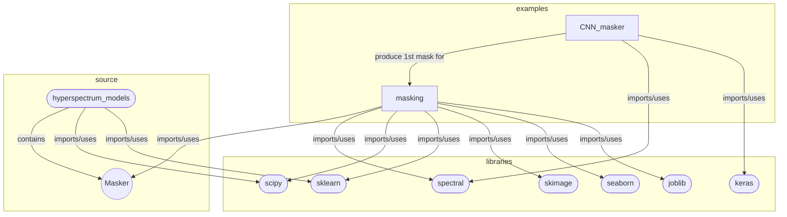

## Code Notes / Diagram
This is a description of how the Masking algorithm works.

### First CNN

#### masking.ipynb 
1. Preprocessing dimensionality-reduction
* Incremental version of PCA (3 componentes = 95%-99%) scikit-learn
* Pad resulting PCA images (Uniform size for CNN)
#### CNN_masker.ipynb
2. Building CNN - Simplified version of SegNet - Convolutional encoder-decoder model
* 13 convolutional layer downsampled three ties by a factor of two
    * Final 34 by 22 pixels
* 13 transpose convolution layers upsample every three layer
    * Until original image size  
* Skip-connections
    * Match encoder to decoder layers (Preserve information of image)
    * Passes output of layer before downsampling to upsampling
#### ???
3. Training CNN
* ADAM, stochastic gradient, batch size =5. until model stop improving (~100 epochs).
#### ???
4. Prediction - Postprocessing
* Wavelet spatial smoothing (Second order Daubechies wavelet scikit -image)
* Clip / Resizing

#### Finer masking (Examples in use Distribution Model.ipynb and multiple_input_model.ipynb)
#### masking.ipynb
5. Trained Data generation (8 randomly selected images)
* k-means clustering method identify clusters (‘core, ‘background’, ‘broken material’)
#### masking.ipynb and hyperspectral_classifier.ipynb - Masker
6. Building NN
* One fully connected layer with ReLU activation
* Classification Layer
#### masking.ipynb
7. Postprocessing
* Smoothing filter applied

### General Arquitecture:
([Square Round])=.py and libraries   
[Square Rect]=.ipynb  
((Cicle))= Classes

### Notebook Description:

* All use numpy, pandas, matplotlib

